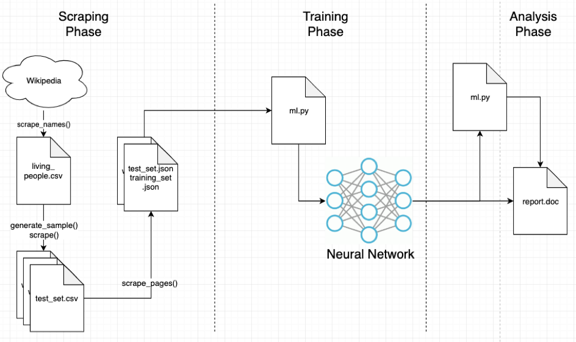
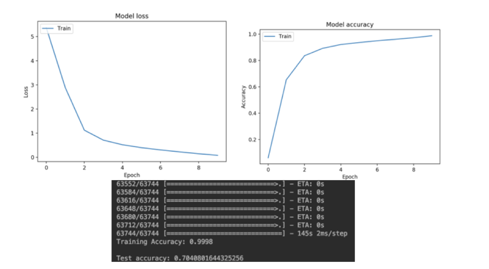

# Wikipedia Category Recommender using Neural Network
Boston University Metropolitan College  
CS 767 Final Project 
John Liao  
Fall Semester - OY1 2019

The overall design is to parse the collected summary Wikipedia page summary text, clean and vectorize using bag-of-words vectorization approach, and then feed it into a neural network. 

The following is the overall flow of the application:



## Scraping Phase
During this phase, the data will be scraped from Wikipedia using their API to collect the summary text and corresponding categories. The sub-workflow is to collect a list of names of living people2. The entire list of living people is scraped from September 23, 2019 using Selenium and the wikipedia.py script (please see Appendix A for source code). In total, there were 900,000+ names scraped and stored in living_people.csv.

Out of the large population, samples are randomly drawn for the training and test data. There will be approximately 100,000 total data points (70/30 ratio of training to test data). The next step is to scrape the summary text and corresponding category information – this is done via the scrape_pages() method. This is by far the most time-consuming portion of the data gathering. The requests are throttled to ensure no rate-limiting/IP block. The output is stored as a JSON file. There was minor cleaning of the data before piping it into the JSON files (removing new lines \n and some other noticeable structured text).

## Data Cleaning
Sentences
It has been quickly understood that neural networks are not able to readily ingest and understand words. The input data has therefore been cleaned for better understanding by the neural network and in a language that it can speak (vectorization). 
For better understanding, the input sentence text is passed through a function clean_text(), which:

1.	Removes punctuation
2.	Tokenizes the text
3.	Removes stop words
4.	Perform stemming – Normalizes words due to different suffixes (e.g. organizes, organizing, organization -> organiz)

For example, the following cleaning is applied to the following text from input phrase for Stephen Hawking:

```“Stephen William Hawking was an English theoretical physicist, cosmologist, and author who was director of research at the Centre for Theoretical Cosmology at the University of Cambridge at the time of his death.”```

Removing punctuation:  
```Stephen William Hawking was an English theoretical physicist cosmologist and author who was director of research at the Centre for Theoretical Cosmology at the University of Cambridge at the time of his death```

Tokenization:  
```['Stephen', 'William', 'Hawking', 'was', 'an', 'English', 'theoretical', 'physicist', 'cosmologist', 'and', 'author', 'who', 'was', 'director', 'of', 'research', 'at', 'the', 'Centre', 'for', 'Theoretical', 'Cosmology', 'at', 'the', 'University', 'of', 'Cambridge', 'at', 'the', 'time', 'of', 'his', 'death']```

Removing stop words:  
```['Stephen', 'William', 'Hawking', 'English', 'theoretical', 'physicist', 'cosmologist', 'author', 'director', 'research', 'Centre', 'Theoretical', 'Cosmology', 'University', 'Cambridge', 'time', 'death']```

Apply stemming:  
```['stephen', 'william', 'hawk', 'english', 'theoret', 'physicist', 'cosmologist', 'author',` 'director', 'research', 'centr', 'theoret', 'cosmolog', 'univers', 'cambridg', 'time', 'death']```

Apply bag of words vectorization:  
```{'stephen': 11, 'william': 15, 'hawk': 8, 'english': 7, 'theoret': 12, 'physicist': 9, 'cosmologist': 4, 'author': 0, 'director': 6, 'research': 10, 'centr': 2, 'cosmolog': 3, 'univers': 14, 'cambridg': 1, 'time': 13, 'death': 5}```

This provides a better starting point for the neural network to connect meaningful words rather than get bogged down in phases like “it”, “that”, etc. The way stemming is applied is very brute force – it simply truncates the end of words. It would be better to actually analyze the context of the word and the meaning and stem it accordingly. A bag of words vectorization proved to have better results and was used instead of n-gram vectorization. 

## Categories
There are a number of categories that apply to each sentence input text. For example, Steven Hawking may have: (1) People born in 1942, (2) Physicist, (3) Cosmologist. For the purpose of this exercise, if the categories contain the following banned keywords, then it is rejected from being considered. Only a single category is selected for each input body of text. 

If the following text exists in the category, then it is automatically removed:
Articles to be, lacking sources, births, all stub articles, all articles, Articles needing, articles with, Articles containing, All Wikipedia, Living people, Articles using, Commons category link, stub articles, All orphaned articles

Hand selecting unique categories causes the test set to perform very poorly. The reason being that multiple categories can be applicable to a specific input text, however, the way Keras is set up for testing accuracy is that it tests against a specific value, i.e. a specific category. For example, if an input text X had categories (1) People born in 1955 and (2) Mathematician with a single output category as People born in 1955 and a similar input text Y with the same applicable categories had guessed Mathematician, this would not be counted as a failed test. 

The category selected for input text was changed to always be the first one. This resulted in a much higher accuracy against the test set. It’s believed that Wikipedia generally orders categories the same way.

The sentences and categories are vectorized using the CountVectorizer from NLTK library, which converts a collection of text to a matrix of token counts. 

## Training Phase
The neural network will be created by stacking layers using the Keras library. The basic theory will be to emulate the mode from the basic text classification example, where the layers will be as follows with a description of each:
1.	Dense layer – I will set this as a fully connected dense layer (relu activation function) with 128 nodes.
2.	Dense layer – I will set this as a single output node with softmax activation function with the number of nodes corresponding to the number of categories for the given training sample set 

The test and training set is split using the train_test_split() function. For the model, the optimizer currently used is ADAM, loss using sparse categorical cross entropy, and accuracy for metrics parameter.

## Training Final Results
With a set of 100,000 input text and corresponding categories (75%/25% breakdown of training/testing set), the model achieved 99.98% training accuracy and 70.41% testing accuracy. 10 was the selected epoch number that achieved good training accuracy and loss optimization. 


Model loss, accuracy and results for 100,000-item data set

As previously mentioned, a low testing accuracy was seen (around 10%). This was resolved by only selecting the first provided category per input text and allowing Keras to select the batch size. 
